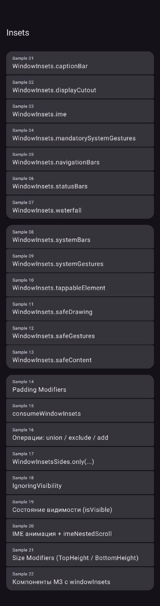

Insets
=

A collection of Android samples demonstrating how to work with `WindowInsets` in Jetpack Compose — from individual inset types to padding modifiers, IME animations, and M3 component integration.

## Samples

| #  | Sample                                                                                                                                                                         |
|----|--------------------------------------------------------------------------------------------------------------------------------------------------------------------------------|
| 01 | [`WindowInsets.captionBar`](app/src/main/kotlin/org/michaelbel/insets/sample01_CaptionBar/Sample01Screen.kt)                                                                   |
| 02 | [`WindowInsets.displayCutout`](app/src/main/kotlin/org/michaelbel/insets/sample02_DisplayCutouts/Sample02Screen.kt)                                                            |
| 03 | [`WindowInsets.ime`](app/src/main/kotlin/org/michaelbel/insets/sample03_Ime/Sample03Screen.kt)                                                                                 |
| 04 | [`WindowInsets.mandatorySystemGestures`](app/src/main/kotlin/org/michaelbel/insets/sample04_MandatorySystemGestures/Sample04Screen.kt)                                         |
| 05 | [`WindowInsets.navigationBars`](app/src/main/kotlin/org/michaelbel/insets/sample05_NavigationBars/Sample05Screen.kt)                                                           |
| 06 | [`WindowInsets.statusBars`](app/src/main/kotlin/org/michaelbel/insets/sample06_StatusBars/Sample06Screen.kt)                                                                   |
| 07 | [`WindowInsets.waterfall`](app/src/main/kotlin/org/michaelbel/insets/sample07_Waterfall/Sample07Screen.kt)                                                                     |
| 08 | [`WindowInsets.systemBars`](app/src/main/kotlin/org/michaelbel/insets/sample08_SystemBars/Sample08Screen.kt)                                                                   |
| 09 | [`WindowInsets.systemGestures`](app/src/main/kotlin/org/michaelbel/insets/sample09_SystemGestures/Sample09Screen.kt)                                                           |
| 10 | [`WindowInsets.tappableElement`](app/src/main/kotlin/org/michaelbel/insets/sample10_TappableElement/Sample10Screen.kt)                                                         |
| 11 | [`WindowInsets.safeDrawing`](app/src/main/kotlin/org/michaelbel/insets/sample11_SafeDrawing/Sample11Screen.kt)                                                                 |
| 12 | [`WindowInsets.safeGestures`](app/src/main/kotlin/org/michaelbel/insets/sample12_SafeGestures/Sample12Screen.kt)                                                               |
| 13 | [`WindowInsets.safeContent`](app/src/main/kotlin/org/michaelbel/insets/sample13_SafeContent/Sample13Screen.kt)                                                                 |
| 14 | [Padding Modifiers](app/src/main/kotlin/org/michaelbel/insets/sample14_PaddingModifiers/Sample14Screen.kt)                                                                     |
| 15 | [`consumeWindowInsets`](app/src/main/kotlin/org/michaelbel/insets/sample15_ConsumeInsets/Sample15Screen.kt)                                                                    |
| 16 | [Operations: `union` / `exclude` / `add`](app/src/main/kotlin/org/michaelbel/insets/sample16_InsetOperations/Sample16Screen.kt)                                                |
| 17 | [`WindowInsetsSides.only(...)`](app/src/main/kotlin/org/michaelbel/insets/sample17_InsetsSides/Sample17Screen.kt)                                                              |
| 18 | [`IgnoringVisibility`](app/src/main/kotlin/org/michaelbel/insets/sample18_IgnoringVisibility/Sample18Screen.kt)                                                                |
| 19 | [Insets visibility (`isVisible`)](app/src/main/kotlin/org/michaelbel/insets/sample19_InsetsVisibility/Sample19Screen.kt)                                                       |
| 20 | [IME animation + `imeNestedScroll`](app/src/main/kotlin/org/michaelbel/insets/sample20_ImeAnimation/Sample20Screen.kt)                                                         |
| 21 | [Size Modifiers (`TopHeight` / `BottomHeight`)](app/src/main/kotlin/org/michaelbel/insets/sample21_SizeModifiers/Sample21Screen.kt)                                            |
| 22 | [M3 components with `windowInsets`](app/src/main/kotlin/org/michaelbel/insets/sample22_ComponentInsets/Sample22Screen.kt)                                                      |
